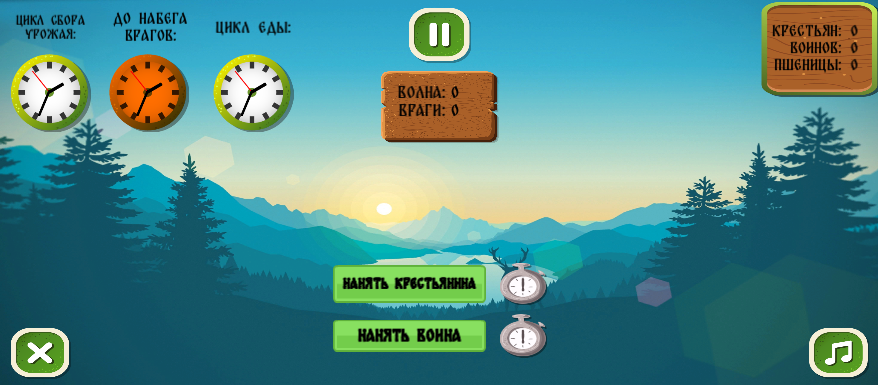

# Save_the_village

Ресурсная стратегия, полностью реализованная на Unity Canvas, где игрок балансирует между производством еды, содержанием армии и подготовкой к волнам врагов. Всё управление происходит на одном экране.

## 🎮 Игровой процесс

### Основные механики
**Три циклических таймера:**
- **Урожай:** По окончании даёт пшеницу (зависит от числа крестьян)
- **Волны врагов:** Нулевая волна - подготовка, затем волны 1-6
- **Потребление еды:** Все юниты потребляют пшеницу по окончании цикла

**Ресурсы и юниты:**
- **Пшеница:** Единственный ресурс, используется для всего
- **Крестьяне:** Стоят 4 пшеницы, увеличивают сбор урожая
- **Воины:** Стоят 8 пшеницы, защищают от волн

**Начальные условия:**
- Крестьяне: 5
- Пшеница: 20
- Воины: 0

### Логика волн
**Всего 6 волн врагов. Каждый враг убивает ровно одного воина.**

Пример:
- Волна 1: 2 врага → погибнет 2 воина (если есть)
- Волна 3: 5 врагов → погибнет 5 воинов
- Если врагов больше, чем воинов → все воины погибают, игра проиграна

**Прогрессия волн:**
1. Волна 0: Подготовка - врагов нет
2. Волны 1-5: Количество врагов растёт с каждой волной
3. Волна 6: Финальная волна - самая сложная

### Условие поражения
- **Если воинов = 0** после волны врагов

### Условие победы
- **Успешно отразить 6-ю волну** и сохранить хотя бы 1 воина

## 🖥️ Интерфейс

**Всё на одном экране:**
- Счётчики пшеницы, крестьян и воинов
- Три таймера с визуальным отсчётом
- Кнопки найма крестьян (4 пшеницы) и воинов (8 пшеницы)
- Индикатор текущей волны (0-6) и количества врагов в следующей волне

**Управление:**
- Только мышью
- Клики по кнопкам найма
- Никаких скрытых меню или окон

## 📊 Логика игры

Каждый крестьянин увеличивает сбор.

### Цикл потребления еды
Пшеница расходуется автоматически по окончании цикла.

### Волны врагов
Если врагов больше чем воинов → все воины погибают → игра проиграна.

## 🏆 Победа и поражение

### Как победить
1. Дожить до конца 6-й волны
2. Сохранить хотя бы 1 воина после 6-й волны
3. Игра покажет сообщение о победе

### Как проиграть
1. **Потерять всех воинов во время волны врагов** (единственное условие поражения)

**Особенность:** Игра продолжается даже при отрицательном количестве пшеницы.

## 🛠️ Техническая информация

**Движок:** Unity 2021.3.4f1  
**Основа:** Canvas UI  
**Архитектура:** три независимых таймера  

**Всего одна сцена** - всё происходит в MainScene.

## 🚀 Запуск

### Для игроков
1. Загрузите последнюю сборку игры
2. Распакуйте архив 
3. Запустите файл `game/my_project(9).exe`(папка с игрой изменила название `Save The Village/My project (7).exe`)

### Для разработчиков
1. Клонируйте репозиторий
2. Откройте проект в Unity **2021.3.4f1** (версия Unity была изменена на **6000.3.9f1**)
3. Запустите сцену `Assets/Scenes/SampleScene.unity`

**Управление:** Кликайте по кнопкам "Нанять крестьянина" (4 пшеницы) и "Нанять воина" (8 пшеницы)

---

*Проект создан для демонстрации работы с Canvas, системами таймеров и стратегического планирования. Игра имеет чёткую цель - пережить 6 волн атак.*
*Баланс не до делан еще тербует доработки*
